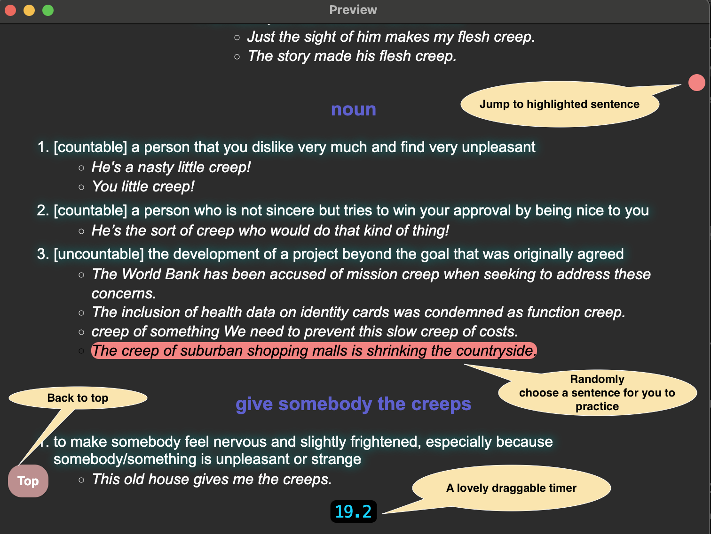
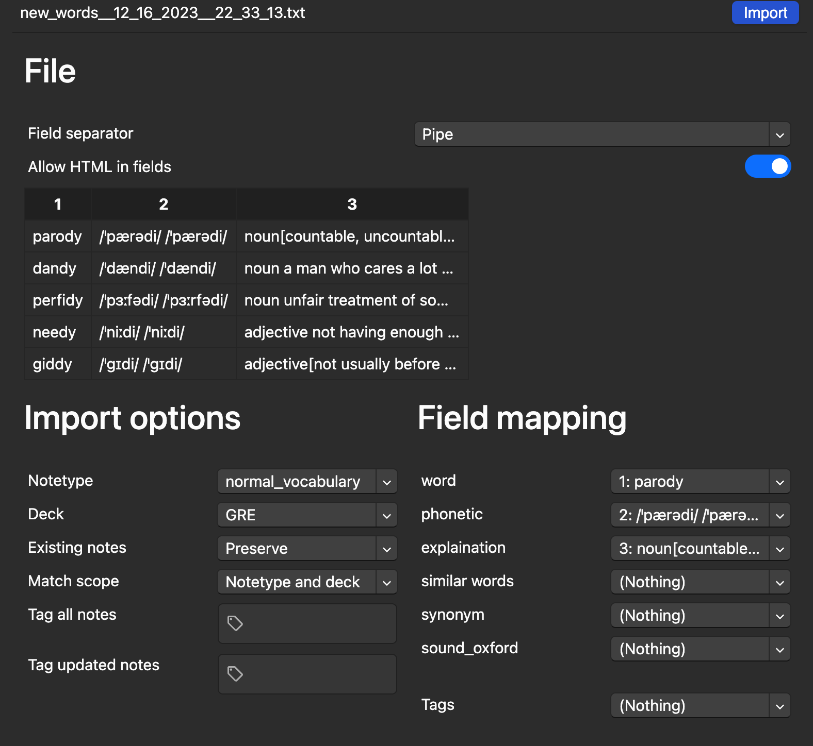
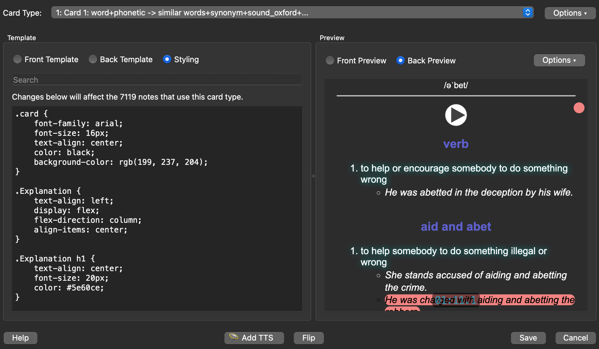

# About this project



Hi, I am Zehao, I created this projected years before but just chosen to publish the source code for university application.

Though some code were just pushed to this repository they were actually written when I was a newbie programmer. They are still working well but don't expect them to be elegant and follow best practice...Thanks for your understanding!

Since they were written years ago I don't think they can represent my current programming skill. So, dear admission officers, please do have a look at my most recent project first: [A time manager](https://github.com/Pear-sudo/time)

# How to use these code

1. You need to buy [Oulu Dictionary (欧陆字典)](https://dict.eudic.net/) and export your favorite Oxford dictionary words. See sample_export.html.
2. Run extracter.py in the same directory with exported html from Oulu dictionary. (Don't forget to install python and beautiful soup)
3. After running, you'll find a new file named new_words_[timestamp].txt
4. Import this file to [Anki](https://apps.ankiweb.net/), the flashcard management software. You should choose "pipe" as seperator (and of course you should set up relevant fields first, see Anki's documents first): 
5. Paste codes in front_template.txt, back_template.txt, and styling.css into your templates (remember to adjust the filed name if your anki field is different from mine):


That's it, cheers!
(code in test.js is same as the one in
```html
<script></script> 
```
part of each template, sorry, I shouldn't put so many lines of code into one file, I was very young and naive when I wrote this...)